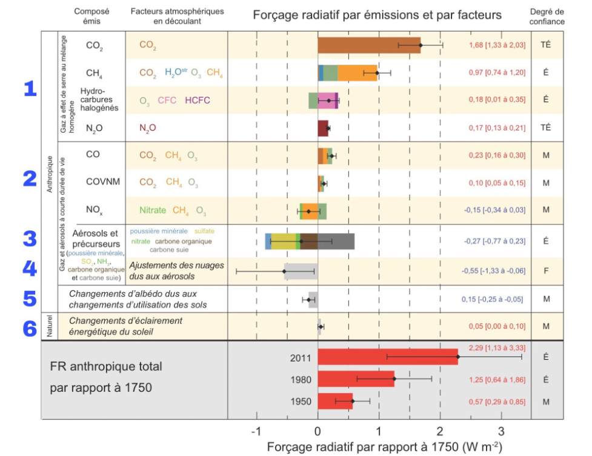

## Les aérosols et leur impact sur le climat

(Encadrant : Sébastien Girault)

Le réchauffement climatique que nous connaissons aujourd'hui provient
d'un déséquilibre du bilan radiatif terrestre. La quantité d'énergie qui
rentre dans le système climatique (atmosphère, cryosphère, océan,
biosphère et lithosphère) est plus faible que l'énergie réémise vers
l'espace. Ceci s'explique par le forçage radiatif de certains composés
naturels mais surtout anthropiques (ce qui explique qu'il y a un
réchauffement aussi brutal et rapide).

Le forçage radiatif correspond à la mesure de la capacité d'un système à
augmenter ou diminuer l'énergie reçue par ce système climatique par
rapport à l'équilibre connu en 1750 (se mesure en W/m2). Le graphique
ci-dessous issu du 5eme rapport du Giec dresse le bilan radiatif
terrestre avec la contribution de l'ensemble des composés émis.

Ainsi les gaz à effet de serre ont un forçage radiatif positif c\'est-à-
dire qu'ils tendent à déséquilibrer le bilan radiatif en augmentant
l'énergie reçue et donc tendent à réchauffer le système (via l'effet de
serre anthropique).

Cependant, l\'anthropique ne veut pas forcément dire participation au
réchauffement climatique. En effet, les ## aérosols émis en partie par
les activités humaines ont un forçage radiatif et donc tendent à
refroidir le système climatique. Le sujet de ce mini projet vise à se
pencher sur ces ## aérosols et à mieux comprendre leur impact sur le
climat.##

## Objectifs :

- Déterminer les principaux aérosols, ainsi que les gaz précurseurs à
leur formation

- Leur principales sources d'émissions,

- Leur mécanismes d'impact sur le climat et leur participation dans la
formation des nuages

- Une parenthèse sur le trou dans la couche d'ozone et les confusions à
ne pas faire avec les aérosols !

## Contact : [seb.girault\@outlook.fr](mailto:sebastien.girault@carbone4.com)
