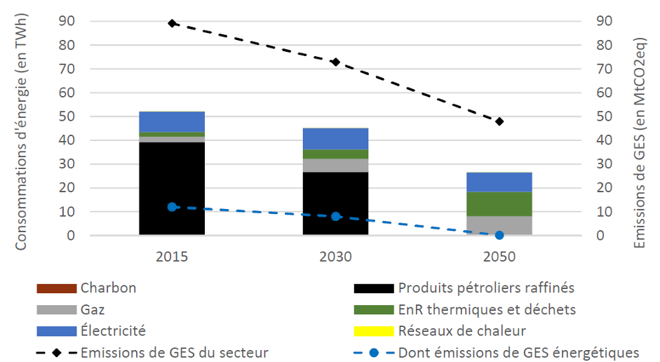

## Scénario Net Zero 2050 : comment décarboner le secteur agricole en France ?

(Encadrant : Christophe Crocombette)

L'agriculture ne représentait en 2015 que 3% des consommations d'énergie
en France. Cependant, elle comptait pour 19% des émissions de gaz à
effet de serre (GES) du bilan national (soit environ 89 Mt CO~2~eq).

La Stratégie Nationale Bas Carbone (feuille de route de l\'État français
dans la lutte contre le changement climatique) révisée en 2018-2019 pour
atteindre la neutralité carbone en 2050 fixe un objectif de baisse de
46% des émissions de GES du secteur de l'agriculture entre 2015 et 2050
\[1\].

Les émissions de GES sont peu liées aux consommations d'énergie du
secteur car elles proviennent essentiellement des émissions de N0~2~
(liées à la fertilisation des sols) et de CH~4~ (liées à l'élevage :
fermentation entérique et gestion des déjections).

{width="6.267716535433071in"
height="3.4305555555555554in"}

Evolution des consommations et émissions de GES du secteur agricole
selon la SNBC \[2\]

Un récent rapport de la Cour des comptes européenne publié en juin 2021
\[3\] met toutefois en avant le fait que les efforts financiers alloués
au secteur agricole en Europe via la Politique Agricole Commune ne
portent pas réellement leurs fruits sur la période 2014-2020.

Le projet aura pour objectif d'étudier finement ce secteur en France
pour comprendre la réalité de ces statistiques, les voies à suivre et
les difficultés qui se présentent pour décarboner le secteur.

Même si les consommations énergétiques pèsent peu dans le bilan, elles
feront l'objet d'une analyse particulière pour répertorier les solutions
les plus prometteuses (voir \[4\]).

Un éclairage sera par ailleurs fait sur la production d'énergie
décarbonée via la mobilisation de la ressource biomasse agricole
(méthanisation / production de biogaz) qui est un atout essentiel à
prendre en compte dans la feuille de route de la SNBC (voir par exemple
\[5\]).

## Bibliographie indicative :

\[1\] Stratégie Nationale Bas Carbone complète révisée, DGEC, mars 2020.

\[2\] Synthèse du scénario de référence de la stratégie française pour
l'énergie et le climat, DGEC, janvier 2020.

\[3\] Common Agricultural Policy and climate - Half of EU climate
spending but farm emissions are not decreasing, special report of the
European Court of Auditors, juin 2021.

\[4\] Agriculture et efficacité énergétique, Propositions et
recommandations pour améliorer l'efficacité énergétique des
exploitations agricoles en France, ADEME, février 2019.

\[5\] Gaz 100 % renouvelables : Comment impulser le mouvement
maintenant, La Fabrique Ecologique, octobre 2018.

Et aussi :

Données et analyses disponibles sur le site du Ministère de
l'Agriculture :
[https://agreste.agriculture.gouv.fr/agreste-web/](https://agreste.agriculture.gouv.fr/agreste-web/)

Rapport "Secten 2020" publié en 2021 par le CITEPA.

Rapports du Haut Conseil pour le Climat.

## Contact : christophe.crocombette\@edf.fr
